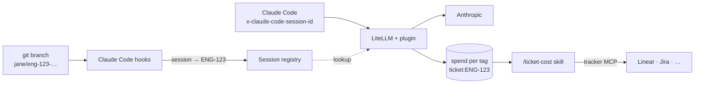

# Tokens per ticket

**What did this ticket cost to build with AI?** Engineers check out a ticket branch and use Claude Code as usual. A [LiteLLM](https://docs.litellm.ai) gateway tags every model call with the ticket, follows branch switches mid-session, and adds spend up per ticket. Nobody tags anything by hand.

Then ask Claude Code: **`/ticket-cost`**. It reads the numbers from the gateway, says what's worth discussing, and — only if you ask — writes them on the ticket through your tracker's MCP server. No API clients here to keep working.

It's a boilerplate and a proof of concept, meant to be copied, adapted, and argued with.

- [What you run](#what-you-run)
- [How it works](#how-it-works)
- [Try it in five minutes](#try-it-in-five-minutes)
- [Roll it out](#roll-it-out)
- [Asking what a ticket cost](#asking-what-a-ticket-cost)
- [The ticket contract](#the-ticket-contract)
- [When something breaks](#when-something-breaks)
- [Decisions and limits](#decisions-and-limits)
- [Working on this repo](#working-on-this-repo)

## What you run

| Piece | What it is | Size |
|---|---|---|
| LiteLLM with Postgres | The gateway Claude Code talks to. You may already run one. | Upstream |
| The session registry (`registry/`) | Which ticket each Claude Code session is on. Laptops reach it over HTTPS. | ~300 lines |
| The gateway plugin (`gateway/tokens_per_ticket.py`) | A LiteLLM pre-call hook that tags each call. Verified on `v1.100.1`; re-check on upgrade. | ~200 lines |
| The CLI adopting repos commit | Claude Code hooks, the commit trailer, `init`. One 137 KB file, no dependencies. | ~800 lines |

Reading spend, judging it, and writing it to a ticket are **skill instructions plus MCP servers**, not code in this repo.

**The numbers are estimates with known gaps.** Costs come from LiteLLM's price map, not your invoice. Work on `main`, sessions started outside the repository root, and branches opened before adoption aren't attributed. On Claude subscriptions, tokens are counted but the dollars are notional. Treat tokens per ticket as a signal to discuss, never a score to rank people by.

## How it works



Claude Code sends `x-claude-code-session-id` on every request ([gateway protocol](https://code.claude.com/docs/en/llm-gateway-protocol)) but reads its headers once at startup, so a fixed header can't follow a branch switch. The laptop therefore reports *which ticket a session is on*, and the gateway does the tagging:

1. Hooks committed in the repo report the session's ticket to the registry: at session start, when `.git/HEAD` moves, and when something changed before a prompt.
2. The plugin looks the session up and adds `ticket:ENG-123`, only for the key that reported it.
3. LiteLLM adds spend up per tag, which `/ticket-cost` reads with one request.

Budgets, alerts, per-key and per-team spend are LiteLLM's own; this repo doesn't rebuild them.

## Try it in five minutes

You need Node 22+, pnpm, and Docker. No provider key.

```bash
pnpm install
cp gateway/.env.example gateway/.env
cp .env.example .env.local
pnpm gateway:up      # LiteLLM + plugin, registry, Postgres
pnpm gateway:smoke   # sessions → tagged calls → spend per ticket
```

The smoke test does what the hooks and Claude Code do: it creates a temporary key, reports two sessions to the registry, calls a priced mock model with only the session id, and checks the spend landed on each ticket. It uses `/v1/chat/completions`, the one route where LiteLLM prices a mock; Claude Code uses `/v1/messages`, so before rollout [check one real session](#check-a-real-session).

## Roll it out

### 1. Gateway, registry, plugin

`gateway/docker-compose.yml` is the reference layout. For a team, deploy LiteLLM with Postgres per [LiteLLM's deploy guide](https://docs.litellm.ai/docs/proxy/deploy), with `ANTHROPIC_API_KEY`, `LITELLM_MASTER_KEY`, and `LITELLM_SALT_KEY` (the salt key can't be rotated later). Then:

- **Registry.** Run `registry/` with LiteLLM's Postgres as `DATABASE_URL` and a shared secret `TPT_REGISTRY_TOKEN`. It keeps its table in its own `tpt` schema, because LiteLLM upgrades drop unknown tables from `public`. It serves plain HTTP on 4100, so put it behind your TLS proxy. Its role needs `SELECT` on `"LiteLLM_VerificationToken"`, `USAGE` on schema `tpt`, and `SELECT, INSERT, UPDATE, DELETE` on `tpt.sessions`.
- **Plugin.** Put `tokens_per_ticket.py` next to LiteLLM's config, add `callbacks: tokens_per_ticket.proxy_handler_instance` under `litellm_settings`, and set `TPT_REGISTRY_URL` and `TPT_REGISTRY_TOKEN` in LiteLLM's environment.

**On a gateway that also serves your product**, check first:
- It stores spend in Postgres and serves Claude model names on `/v1/messages` (the `claude-*` wildcard in `gateway/litellm.config.yaml` is the smallest way).
- The plugin refuses pass-through routes (`/anthropic/*`, `/vertex_ai/*`, …) for **every** key, because tags there can't be checked. If product traffic uses them, set `TPT_ALLOW_PASS_THROUGH=true` and rely on `allowed_routes` for developer keys.

### 2. Keys

Developers never use the master key. Give each one a virtual key limited to Claude Code's routes ([virtual keys](https://docs.litellm.ai/docs/proxy/virtual_keys)):

```bash
curl -X POST "$LITELLM_BASE_URL/key/generate" \
  -H "Authorization: Bearer $LITELLM_MASTER_KEY" -H "Content-Type: application/json" \
  -d '{"key_alias": "jane", "max_budget": 200, "budget_duration": "30d", "allowed_routes": ["anthropic_routes"]}'
```

`/ticket-cost` needs a key that reads **all** spend. A developer's key answers with only its own, silently. Create a read-only viewer without model access, and treat it like an admin credential ([access control](https://docs.litellm.ai/docs/proxy/access_control)):

```bash
curl -X POST "$LITELLM_BASE_URL/user/new" \
  -H "Authorization: Bearer $LITELLM_MASTER_KEY" -H "Content-Type: application/json" \
  -d '{"user_id": "spend-reader", "user_role": "proxy_admin_viewer", "models": ["no-default-models"]}'
```

That key belongs with whoever reports on spend, not on every laptop.

### 3. Point Claude Code at the gateway

Each engineer, or everyone at once through [managed settings](https://code.claude.com/docs/en/managed-settings), in `~/.claude/settings.json`:

```json
{ "env": { "ANTHROPIC_BASE_URL": "https://litellm.your-company.dev", "ANTHROPIC_AUTH_TOKEN": "sk-…their virtual key…" } }
```

Every engineer also needs Node 18+ on their PATH; the hook skips quietly without it. Teams on Claude subscriptions can pass the key as `x-litellm-api-key` in `ANTHROPIC_CUSTOM_HEADERS` instead ([LiteLLM guide](https://docs.litellm.ai/docs/tutorials/claude_code_max_subscription)). An `apiKeyHelper` isn't supported.

### 4. Set up each repository, once

```bash
node ../tokens-per-ticket/.tokens-per-ticket/tpt.mjs init --teams ENG,WEB --registry-url https://tpt-registry.your-company.dev
git add tokens-per-ticket.yaml .tokens-per-ticket .claude .gitignore && git commit -m "chore: adopt tokens-per-ticket"
```

`init` is safe to re-run. It writes `tokens-per-ticket.yaml`, the CLI as one file, the hooks and the `/ticket-cost` skill in `.claude/`, `.env.local` in `.gitignore`, and a `prepare-commit-msg` hook in `.git/hooks` (never overwriting an existing one).

**Branches opened before this commit aren't attributed** until they merge the default branch.

### Check a real session

With a provider key on the gateway, start `claude` at the repository root on a ticket branch and ask it something. At session start the hook tells Claude which ticket the work counts toward, and says what's missing when something is off: no gateway, no key, or an unreachable registry. A minute later, `/ticket-cost` should show spend above $0.

## Asking what a ticket cost

In Claude Code, on a ticket branch:

```
/ticket-cost              # this branch's ticket, last 30 days
/ticket-cost ENG-123 --days 90
/ticket-cost --post       # also write the figures on the ticket
```

The skill (`.claude/skills/ticket-cost/`) is plain instructions:

1. `node .tokens-per-ticket/tpt.mjs ticket` prints the branch's ticket key and spend tag, so nothing has to guess your branch convention.
2. One `curl` to LiteLLM's `/tag/daily/activity` for that tag returns spend, tokens, cache reads, requests and the model split.
3. Claude reports the totals and at most three observations the numbers support.
4. With `--post`, it writes or updates **one** comment on the ticket through your tracker's MCP server ([Linear](https://linear.app/docs/mcp), [Jira](https://support.atlassian.com/rovo/docs/getting-started-with-the-atlassian-remote-mcp-server/), or whatever your team runs), matching on a `_Updated by tokens-per-ticket_` line.

Change what the comment says, or which tracker it goes to, by editing the skill. For a scheduled report, run Claude Code headless in CI (`claude -p "/ticket-cost ENG-123 --post"`) with the spend-reader key and your tracker's MCP server configured.

## The ticket contract

`tokens-per-ticket.yaml` is the one file a team edits:

```yaml
tracker: linear                          # which tracker the skill posts to
key:
  pattern: "[A-Z][A-Z0-9]*-[0-9]+"
  teams: [ENG, WEB]                      # set it: without it, fix/utf-8-parsing reads as UTF-8
branch:
  template: "{user}/{key}-{slug}"        # Linear's "Copy git branch name"
automation:
  sessions: true
  registry_url: "https://tpt-registry.your-company.dev"   # TPT_REGISTRY_URL overrides it
  commit_trailer: "Ticket"               # or false
```

Branches are read **by the template**, not by searching for anything key-shaped, so `dependabot/…/next-16` isn't ticket `NEXT-16`. `{key}` is the key lowercased, as Linear writes it; `{KEY}` keeps it as printed, which Jira needs: `feature/{KEY}_{slug}`. Parsing ignores case either way. A detached HEAD names no branch, so it isn't attributed.

## When something breaks

| If this is down or wrong | Developers see | Spend |
|---|---|---|
| Registry unreachable | A one-line warning; calls work normally | Not attributed until it's back |
| Registry slow | Nothing: lookups give up after 300 ms, and pause 15 s after three failures | Some calls untagged |
| Gateway plugin misconfigured | Nothing; LiteLLM logs an error | Not attributed |
| LiteLLM upgraded | Nothing | Re-run `pnpm gateway:smoke` against it |
| No Node, a subfolder start, a pre-adoption branch | Nothing | Not attributed |

**To remove it** from a repo: delete `tokens-per-ticket.yaml`, `.tokens-per-ticket/`, the hook entries and `ticket-cost` skill in `.claude/`, and `.git/hooks/prepare-commit-msg`. On the gateway, remove the `callbacks` line.

## Decisions and limits

- **Agentic where a model is better.** Reading numbers, judging them, and writing them to a tracker are a skill plus MCP servers. That's why there is no Linear client, no Jira client, no report renderer, and no query layer in this repo — and why any tracker with an MCP server works.
- **Mechanical where it must be.** Hooks run on every prompt and must be fast, quiet, and unable to fail a session, so they stay plain code. Same for the plugin, which sits in the request path.
- **Attribution is for visibility, not billing enforcement.** Anyone can name a branch after any ticket. What is prevented: clients can't set `ticket:` tags themselves (400), and a key can't attribute another key's calls — the registry checks the reporting key against LiteLLM's key table, stores only `sha256(key)`, and the plugin tags only calls from that key.
- **Repo config is trusted like repo code.** A repository decides where hooks send the key (`tokens-per-ticket.yaml`) and what they run (`.claude/settings.json`), as in [Claude Code's trust model](https://code.claude.com/docs/en/permissions). Review `.claude/` and `.tokens-per-ticket/` with CODEOWNERS.
- **Accuracy.** The call right after a branch switch can still carry the old ticket (lookups are cached 2 s). Subagents count toward their session's ticket. `prompt_tokens` includes cache reads and writes. LiteLLM writes spend in batches, so the last minute may not show yet. LiteLLM tag budgets don't see these tags; key and team budgets work as usual.
- **Scope.** Claude Code behind LiteLLM. Other tools and gateways aren't attributed.

<details>
<summary>Why this exists</summary>

Teams find out what AI agents cost when an org-wide limit is hit, and even then the bill says *who*, never *which piece of work*. I think AI-driven engineering should be reviewed on:

1. **Visibility per person and per ticket**, not one shared key.
2. **Spend next to the outcome**, so "$X" becomes "this ticket cost $X for what it delivered".
3. **Caps that stop usage** instead of billing it.
4. **Model choice by task type.** The model split on each ticket shows whether it's happening.
5. **A signal, not a score.** High spend can mean a hard problem, or an agent looping while nobody built a mental model of the feature.

</details>

## Working on this repo

```bash
pnpm test:unit      # the CLI and the contract (node:test)
pnpm test:gateway   # the plugin (Python, no LiteLLM needed)
pnpm test:registry  # the registry (TPT_TEST_DATABASE_URL adds the Postgres test)
pnpm gateway:up && pnpm gateway:smoke
pnpm build:cli      # rebuild .tokens-per-ticket/tpt.mjs after changing src/
pnpm typecheck && pnpm lint
```

`src/cli` has the hook, the commit trailer, `init`, and `ticket`. `src/lib` has the contract and the registry client. `registry/` and `gateway/` are the two services. Conventions are in [CLAUDE.md](CLAUDE.md).

Checked against: Claude Code [gateway](https://code.claude.com/docs/en/llm-gateway), [hooks](https://code.claude.com/docs/en/hooks) and [settings](https://code.claude.com/docs/en/settings) docs, plus live sessions on 2.1.271. LiteLLM [request tags](https://docs.litellm.ai/docs/proxy/request_tags), [call hooks](https://docs.litellm.ai/docs/proxy/call_hooks), [Claude Code cost tracking](https://docs.litellm.ai/docs/tutorials/claude_code_customer_tracking), and its `v1.100.1` source. git [interpret-trailers](https://git-scm.com/docs/git-interpret-trailers).

## License

MIT
