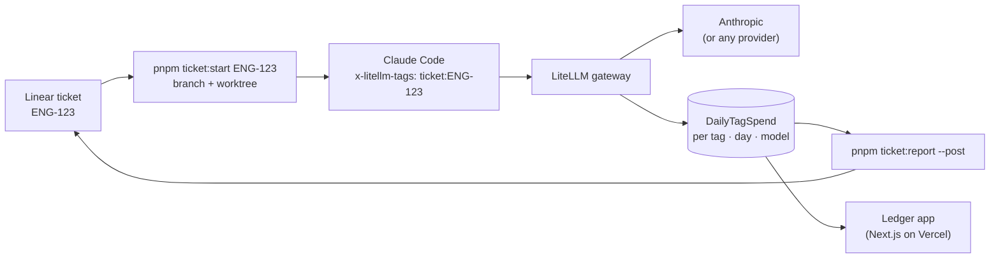

# Tokens per ticket

**What did this ticket cost to build with AI?** This repository makes that a question your gateway can answer, by convention, with nobody tagging anything by hand.

A developer picks ticket `ENG-123`, runs `pnpm ticket:start ENG-123`, and works with Claude Code as usual. Every model call in that session carries the tag `ticket:ENG-123` through a [LiteLLM](https://docs.litellm.ai) gateway. LiteLLM already adds up spend per tag. This repo supplies the conventions and the small amount of glue around it: a branch contract, a launcher, a Claude Code hook, a report that lands on the Linear ticket, and a Next.js ledger you can deploy to Vercel.


It's a boilerplate and an argument, meant to be copied, adapted, and discussed.

- [Why this exists](#why-this-exists)
- [How it works](#how-it-works)
- [Try it in five minutes](#try-it-in-five-minutes-no-provider-key)
- [Use it for real](#use-it-for-real)
- [The ticket contract](#the-ticket-contract)
- [The ledger app and Vercel](#the-ledger-app-and-vercel)
- [Claude Code integration](#claude-code-integration)
- [Decisions, limits, and gotchas](#decisions-limits-and-gotchas)
- [Working on this repo](#working-on-this-repo)
- [Sources](#sources)

---

## Why this exists

Building with AI agents is cheap to start and easy to overdo. Teams find out what their agents cost when an organization-wide limit is hit, not before, and even then the bill says *who* or *which key*, never *which piece of work*. That makes the useful questions unanswerable:

- What did this feature cost to build, and was it worth it?
- Which tickets burn tokens far out of proportion to their size?
- Is spend going up because we ship more, or because we loop more?

The minimum, to me, is this: **route development traffic through one gateway, and attach the ticket to every call.** Everything else (budgets, dashboards, reviews) builds on that.

### What I think AI-driven engineering should be reviewed on

The repo is built so these can be discussed with real numbers:

1. **Visibility per person and per ticket, not one shared key.** A single org-wide cap tells you about a problem after the damage is done.
2. **Spend next to the outcome.** Tokens on the ticket turn "we spent $X" into "this ticket cost $X for what it delivered".
3. **Caps that stop usage instead of billing it.** Per-developer budgets by default, with an agreed path for heavy runs.
4. **Model choice by task type.** Cheap models for mechanical fan-out, top models for judgment calls. The model split on each ticket shows whether that's happening.
5. **Tokens per ticket is a signal, not a score.** High spend can mean a hard problem. It can also mean the agent went round in loops while no human built a mental model of the feature, which you pay for later in maintenance. Talk about it; don't rank people by it.

---

## How it works



### What LiteLLM already does, and what this repo adds

The rule for this repo: **don't rebuild what the gateway already does.**

| Need | Where it comes from |
|---|---|
| Attach a tag to every request | LiteLLM reads the `x-litellm-tags` header ([request tags](https://docs.litellm.ai/docs/proxy/request_tags)). Claude Code sends custom headers from `ANTHROPIC_CUSTOM_HEADERS` ([env vars](https://code.claude.com/docs/en/env-vars)). |
| Add up spend per tag, per day, per model, with cache tokens | LiteLLM's `LiteLLM_DailyTagSpend` table, read through `GET /tag/daily/activity` |
| Group requests by Claude Code session | LiteLLM detects `x-claude-code-session-id` on its own ([request headers](https://docs.litellm.ai/docs/proxy/request_headers)) |
| Budgets per developer key | LiteLLM virtual keys with `max_budget` ([virtual keys](https://docs.litellm.ai/docs/proxy/virtual_keys)) |
| Budget alerts, weekly spend reports per tag | LiteLLM alerting ([alerting](https://docs.litellm.ai/docs/proxy/alerting)) |
| **Branch name → ticket key**, configurable per team | **This repo:** `ticket-contract.yaml` + `src/lib/contract.ts` |
| **One session = one ticket**, launched with the right tag | **This repo:** `pnpm ticket:start` |
| **A warning when branch and tag disagree** | **This repo:** a Claude Code `SessionStart` hook |
| **The cost on the ticket** | **This repo:** `pnpm ticket:report --post` (one Linear comment, updated in place) |
| **A view people will actually open** | **This repo:** the ledger app |

---

## Try it in five minutes (no provider key)

You need Node 22+, pnpm, and Docker.

```bash
pnpm install
cp gateway/.env.example gateway/.env      # local defaults are fine for a trial
cp .env.example .env.local
pnpm gateway:up                           # LiteLLM v1.100.1 + Postgres on :4000
pnpm gateway:smoke                        # tagged calls to a priced mock model
pnpm ticket:report SMOKE-1 --days 1       # the report, straight from LiteLLM
pnpm dev                                  # the ledger on :3000 (sample data)
```

To see your gateway's numbers in the ledger instead of sample data, set `LEDGER_DATA=litellm` in `.env.local` and restart `pnpm dev`.

The smoke test uses `mock-ticket-model`, defined in `gateway/litellm.config.yaml`. It returns a canned answer but still gets tokens counted and priced, so the whole loop runs without an Anthropic key.

---

## Use it for real

### 1. Run the gateway

Locally, `pnpm gateway:up` is enough. For a team, deploy LiteLLM with Postgres somewhere developers and the ledger can both reach it, following [LiteLLM's deploy guide](https://docs.litellm.ai/docs/proxy/deploy). Put your `ANTHROPIC_API_KEY` in the gateway's environment, and set `LITELLM_MASTER_KEY` and `LITELLM_SALT_KEY`. The salt key can't be rotated once models are stored, so choose it once.

If you already run LiteLLM for your product, you can point development traffic at the same gateway. Tags come from request headers, so nothing ticket-specific goes in its config, but check three things first:

- **It stores spend in Postgres.** `/tag/daily/activity` reads the `LiteLLM_DailyTagSpend` table; a gateway without `DATABASE_URL` has nothing to report.
- **It serves the model names Claude Code asks for**, on the Anthropic Messages format (`/v1/messages`). A product config that only lists your product's models will reject them. The `claude-*` wildcard in `gateway/litellm.config.yaml` is the smallest way to add them ([Claude Code gateway compatibility](https://code.claude.com/docs/en/llm-gateway-protocol)).
- **Its version has `/tag/daily/activity`.** This repo was verified against `v1.100.1`. If yours is older, call the route with an admin key before rolling anything out.

Budgets and alerts you set for the product also see this traffic, and the ledger's key can read the product's spend too.

### 2. Give each developer a key

Developers never use the master key. Create a virtual key per person, with a budget:

```bash
curl -X POST "$LITELLM_BASE_URL/key/generate" \
  -H "Authorization: Bearer $LITELLM_MASTER_KEY" \
  -H "Content-Type: application/json" \
  -d '{"key_alias": "mostafa", "max_budget": 200, "budget_duration": "30d"}'
```

These keys can call models, but they can't read spend routes (`/tag/daily/activity` answers 401). The ledger and `ticket:report` need a key that can. Don't hand out the master key for that: create a user with LiteLLM's read-only `proxy_admin_viewer` role, which can view all spend but can't create keys or users ([access control](https://docs.litellm.ai/docs/proxy/access_control)). `/user/new` returns its key:

```bash
curl -X POST "$LITELLM_BASE_URL/user/new" \
  -H "Authorization: Bearer $LITELLM_MASTER_KEY" \
  -H "Content-Type: application/json" \
  -d '{"user_id": "ledger-reader", "user_role": "proxy_admin_viewer"}'
```

Checked on `v1.100.1`: that key reads `/tag/daily/activity` and gets 403 on `/key/generate`. It can still call models and it sees the whole organization's spend, so treat it as a secret: put it in Vercel's server-side environment, and give it only to the people who run `ticket:report`.

### 3. Connect Claude Code to the gateway

Each developer adds this to `~/.claude/settings.json` ([Claude Code LLM gateway docs](https://code.claude.com/docs/en/llm-gateway)):

```json
{
  "env": {
    "ANTHROPIC_BASE_URL": "https://litellm.your-company.dev",
    "ANTHROPIC_AUTH_TOKEN": "sk-...their virtual key..."
  }
}
```

While a gateway credential is active, Claude Code bills per token to whoever owns the provider key behind the gateway, not to the developer's claude.ai subscription. If your team keeps subscriptions, LiteLLM documents a [Max subscription setup](https://docs.litellm.ai/docs/tutorials/claude_code_max_subscription): tokens are still counted per ticket, but they aren't billed per token.

### 4. Put the launcher in the repos you work in

`ticket:start`, `ticket:report`, the hook, and the skills act on **the git repository they live in**. Run from a clone of this repo, `ticket:start` makes a worktree of this repo, not of your product. So copy them into each product repository (the ledger app stays here and deploys on its own):

| Copy | Why |
|---|---|
| `ticket-contract.yaml` | branch and tag rules |
| `scripts/ticket-start.mts`, `scripts/ticket-report.mts` | the two commands |
| `src/lib/{contract,env,format,git,launch,ledger,linear,litellm,report}.ts` | what the scripts import; none of them import Next.js |
| `.claude/hooks/ticket-guard.mjs`, `.claude/skills/ticket-start`, `.claude/skills/ticket-cost`, and the `hooks` block of `.claude/settings.json` | the Claude Code integration |

Then add the dev dependencies `tsx`, `yaml`, and `zod`, and the two scripts to `package.json`:

```json
"ticket:start": "node --import tsx scripts/ticket-start.mts",
"ticket:report": "node --import tsx scripts/ticket-report.mts"
```

If `src/lib` is taken in that repo, put the files elsewhere and update the imports in the scripts and the `src/lib/contract.ts` path in the hook. Each developer puts `LITELLM_BASE_URL` and `LITELLM_API_KEY` in that repo's `.env.local` (see `.env.example`), and `LINEAR_API_KEY` if they post reports. The scripts also read the main checkout's `.env.local` when run inside a ticket worktree, which never has its own.

### 5. Start a ticket

```bash
pnpm ticket:start ENG-123 "retry checkout on 429"
```

This:

1. names a branch from the contract: `{user}/eng-123-retry-checkout-on-429`, where `{user}` is your `git config user.name` slugged (set `TICKET_USER` to override)
2. creates it in its own worktree, `../<repo>.worktrees/<user>__eng-123-…`, so your current checkout is never switched and uncommitted work is never touched
3. launches `claude` there with `x-litellm-tags: ticket:ENG-123`, and names the session `ENG-123`

Running it again for the same ticket reuses the worktree. Use `--print` to get the command without launching, and `--base origin/main` to choose where a new branch starts.

### 6. See what it cost

```bash
pnpm ticket:report                  # the ticket of the current branch, last 30 days
pnpm ticket:report ENG-123 --post   # also create or update the comment on the Linear ticket
```

`--post` writes to Linear only, and needs `tracker: linear` in the contract and a Linear personal API key in `LINEAR_API_KEY` (in the main checkout's `.env.local`; the script finds it from ticket worktrees too). With any other tracker, run the report without `--post` and paste it into the ticket. It keeps exactly one report comment per ticket and updates it on every run. Run it at PR time, on a schedule, or before a retro.


---

## The ticket contract

`ticket-contract.yaml` is the one file a team edits to adopt this repo:

```yaml
key:
  pattern: "[A-Z][A-Z0-9]*-[0-9]+"   # how your tracker prints keys
  teams: []                           # optional allowlist, e.g. [ENG, AIS]
branch:
  template: "{user}/{key}-{slug}"     # Linear's default "Copy git branch name"
tag:
  prefix: "ticket:"
worktree:
  path: "../{repo}.worktrees/{branch}"
```

Branches are parsed **by the template**, not by searching for something that looks like a key. A loose search reads `dependabot/npm_and_yarn/next-16` as ticket `NEXT-16`. With the template, branches outside the contract (`main`, spikes, bots) are simply unattributed. That's the honest answer.

`{key}` writes the key lowercased, as Linear does. `{KEY}` keeps it as the tracker prints it. Using Jira with `feature/PROJ-42_login`? Set `template: "feature/{KEY}_{slug}"`: Jira only [links branches whose key is uppercase](https://support.atlassian.com/jira-software-cloud/docs/reference-issues-in-your-development-work/), and on a case-insensitive file system (macOS) a lowercased `feature/proj-42_login` collides with an existing `feature/PROJ-42_login`. Parsing is case-insensitive either way, so hand-typed branches still count. `ticket:report --post` only writes to Linear; see [the ticket report](#5-see-what-it-cost).

---

## The ledger app and Vercel

The ledger is a Next.js 16 app with two pages: every ticket in a date range, and one ticket's spend per day, split by model. The ticket page previews exactly what `--post` writes to Linear.

It has one AI feature, **Review spend**. A model reads a ticket's numbers and points out what's worth a conversation. That call goes through the same gateway, tagged `app:ledger`, so the app's own runtime tokens never count toward any ticket.

### Environment

| Variable | Purpose |
|---|---|
| `LEDGER_DATA` | `sample` (default) or `litellm` |
| `LITELLM_BASE_URL` | Gateway URL |
| `LITELLM_API_KEY` | A key that can read spend routes: the master key locally, a [`proxy_admin_viewer` key](#2-give-each-developer-a-key) in production. Server-side only; never prefix it with `NEXT_PUBLIC_`. |
| `LEDGER_REVIEW_MODEL` | Model for Review spend, e.g. `claude-haiku-4-5`. Empty turns the feature off. In production it also needs `LEDGER_BASIC_AUTH`, because each click spends tokens on `LITELLM_API_KEY`. |
| `LEDGER_BASIC_AUTH` | `user:password`. Required in production when `LEDGER_DATA=litellm`. |
| `LINEAR_API_KEY` | Only for `pnpm ticket:report --post` |

### Deploying

Import the repository into Vercel. Nothing else is needed for a public demo: sample data is the default, and it's labelled as sample data on every page. Leave `LEDGER_REVIEW_MODEL` unset on a public demo; the app keeps the review off in production without `LEDGER_BASIC_AUTH`.

To deploy against a real gateway:

1. Set `LEDGER_DATA=litellm`, `LITELLM_BASE_URL`, and `LITELLM_API_KEY`. The ledger's functions call the gateway from Vercel, so `LITELLM_BASE_URL` must be reachable from there, not only from your office network or VPN.
2. Set `LEDGER_BASIC_AUTH`. The app refuses to show live data in production without it, because the ledger shows the whole organization's spend.
3. For more than a team demo, put it behind [Vercel Deployment Protection](https://vercel.com/docs/deployment-protection) or your SSO as well.

`ticket-contract.yaml` is read at request time and included in every function through `outputFileTracingIncludes` in `next.config.ts`.

---

## Claude Code integration

Everything lives in `.claude/` and is committed, so the whole team gets it.

- **`SessionStart` hook** (`.claude/hooks/ticket-guard.mjs`). It tells Claude which ticket the session bills and names the session after the ticket. It warns you when something is off: the branch is `ENG-42` but the tag says `ENG-7`, there's no tag, or the session isn't pointed at the gateway. It never blocks, and it skips quietly in a worktree whose dependencies aren't installed yet.
- **`/ticket-start ENG-123 title`** prepares the worktree and gives you the command to paste. A running session can't change its tag, so the skill doesn't pretend to.
- **`/ticket-cost`** runs the report and adds up to three observations the numbers support. It posts to Linear only when you ask.

---

## Decisions, limits, and gotchas

- **One session is one ticket.** Claude Code reads `ANTHROPIC_CUSTOM_HEADERS` once at startup, so a `git switch` mid-session would keep billing the old ticket. One worktree per ticket makes that hard to do by accident, and the hook catches it when it happens. If your team really does switch tickets mid-session, the next step is a LiteLLM [pre-call hook](https://docs.litellm.ai/docs/proxy/call_hooks) that maps the session id to the current ticket on the gateway side.
- **The header goes through `claude --settings`, not a shell export.** When the same variable is set in the shell and in a settings file's `env` block, the settings file wins ([precedence](https://code.claude.com/docs/en/env-vars)). An exported tag could be silently ignored. The launcher keeps any custom headers and non-ticket tags you already send.
- **Spend is written in batches.** Calls from the last minute or so may not show yet.
- **LiteLLM adds its own tags.** Every request is also tagged with its `User-Agent`, so one request appears under several tags. The ledger reads per-tag breakdowns and never adds a day's totals across tags, to avoid counting the same request twice.
- **"Input tokens" include cache reads and writes.** LiteLLM folds Anthropic's cache tokens into `prompt_tokens`, so the cache share is cache reads ÷ input tokens.
- **Development tokens only.** The ledger tracks what building a ticket cost. The app's own review calls are tagged `app:ledger` and stay out of it.
- **Tag budgets are possible, but not configured here.** LiteLLM merges `x-litellm-tags` into the request before its tag-budget check, so a budget on `ticket:ENG-123` would apply ([tag budgets](https://docs.litellm.ai/docs/proxy/tag_budgets)). Check your LiteLLM license tier before relying on it.
- **The gateway image is pinned** to `v1.100.1`, the version this repo was verified against. LiteLLM recommends pinned tags so rollbacks are deterministic.
- **The mock model is only priced on `/v1/chat/completions`.** LiteLLM's `/v1/messages` mock path returns synthetic usage with no cost, which is why the smoke test uses the OpenAI-format endpoint.

---

## Working on this repo

```bash
pnpm dev             # ledger on :3000
pnpm test:unit       # node:test via tsx, including responses recorded from a real gateway
pnpm test:e2e        # Playwright on :3100, desktop + phone, sample data
pnpm typecheck
pnpm lint
```

```
ticket-contract.yaml     the one file a team edits
gateway/                 LiteLLM + Postgres (docker compose), config, env example
scripts/                 ticket:start, ticket:report, gateway:smoke
src/lib/                 contract, LiteLLM client, ledger math, report, Linear, launcher
src/app/                 the ledger (Next.js 16 App Router)
src/proxy.ts             optional basic-auth gate
.claude/                 SessionStart hook, /ticket-start, /ticket-cost, permissions
tests/unit, tests/e2e    unit and browser tests; tests/fixtures holds recorded gateway responses
```

Work here the way the repo argues for: one ticket per worktree, small commits with [Conventional Commits](https://www.conventionalcommits.org) messages (`feat(cli): …`, `fix(ledger): …`), and a Playwright spec with any UI change. The details are in [CLAUDE.md](CLAUDE.md).

---

## Sources

Every integration point above was checked against these, and where noted, against LiteLLM's source and a running `v1.100.1` gateway:

- Claude Code: [LLM gateways](https://code.claude.com/docs/en/llm-gateway), [gateway protocol and headers](https://code.claude.com/docs/en/llm-gateway-protocol), [environment variables](https://code.claude.com/docs/en/env-vars), [settings precedence](https://code.claude.com/docs/en/settings), [CLI flags](https://code.claude.com/docs/en/cli-reference), [hooks](https://code.claude.com/docs/en/hooks), [skills](https://code.claude.com/docs/en/skills)
- LiteLLM: [Claude Code cost tracking](https://docs.litellm.ai/docs/tutorials/claude_code_customer_tracking), [request tags](https://docs.litellm.ai/docs/proxy/request_tags), [request headers](https://docs.litellm.ai/docs/proxy/request_headers), [deploy](https://docs.litellm.ai/docs/proxy/deploy), [custom pricing](https://docs.litellm.ai/docs/proxy/custom_pricing), [tag budgets](https://docs.litellm.ai/docs/proxy/tag_budgets), [alerting](https://docs.litellm.ai/docs/proxy/alerting), [spend log retention](https://docs.litellm.ai/docs/proxy/spend_logs_deletion)
- Linear: [GraphQL API](https://linear.app/developers/graphql), [branch naming](https://linear.app/changelog/2020-04-13-branch-naming)
- Next.js 16 docs shipped in `node_modules/next/dist/docs` (Proxy, `connection()`, output file tracing)

## License

MIT
