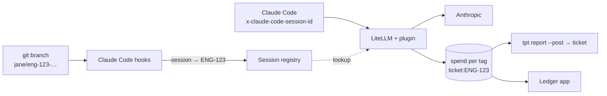

# Tokens per ticket

**What did this ticket cost to build with AI?** Engineers check out a ticket branch and use Claude Code as usual. A [LiteLLM](https://docs.litellm.ai) gateway tags every model call with the ticket, follows branch switches mid-session, and adds up spend per ticket. Nobody tags anything by hand.


It's a boilerplate and a proof of concept, meant to be copied, adapted, and discussed.

- [What you get, and what it costs to run](#what-you-get-and-what-it-costs-to-run)
- [How it works](#how-it-works)
- [Try it in five minutes](#try-it-in-five-minutes)
- [Roll it out](#roll-it-out)
- [See what a ticket cost](#see-what-a-ticket-cost)
- [The ticket contract](#the-ticket-contract)
- [The ledger app](#the-ledger-app)
- [When something breaks](#when-something-breaks)
- [Decisions and limits](#decisions-and-limits)
- [Working on this repo](#working-on-this-repo)

## What you get, and what it costs to run

**You get** `ticket:ENG-123` tags on every Claude Code call, spend per ticket in LiteLLM, a report posted to the Linear or Jira ticket, a `Ticket: ENG-123` trailer on commits, and a small Next.js ledger.

**You run** three things beyond Claude Code, and someone has to own them:

| Piece | What it is |
|---|---|
| LiteLLM with Postgres | The gateway developers' Claude Code talks to. You may already run one. |
| The session registry (`registry/`) | A small Node service: which ticket each Claude Code session is on. Laptops reach it over HTTPS. |
| The gateway plugin (`gateway/tokens_per_ticket.py`) | A LiteLLM pre-call hook that tags each call. Verified on LiteLLM `v1.100.1`; re-check it when you upgrade. |

The ledger on Vercel is optional: `tpt report` and LiteLLM's own UI read the same numbers.

**The numbers are estimates with known gaps.** Costs come from LiteLLM's price map, not your invoice. Work on `main`, sessions started outside the repository root, and branches opened before adoption aren't attributed. On Claude subscriptions, tokens are counted but the dollars are notional. [Decisions and limits](#decisions-and-limits) has the full list. Treat tokens per ticket as a signal to talk about, not a score to rank people by.

## How it works



Claude Code sends `x-claude-code-session-id` on every request ([gateway protocol](https://code.claude.com/docs/en/llm-gateway-protocol)), but it can't change request headers mid-session. So the laptop reports *which ticket a session is on*, and the gateway does the tagging:

1. Hooks committed in the repo (`.claude/settings.json`) report the session's ticket to the registry at session start, when `.git/HEAD` moves, and when something changed before a prompt.
2. The plugin looks the session up and adds `ticket:ENG-123` to the call's tags, only for the key that reported the session.
3. LiteLLM adds up spend per tag in `LiteLLM_DailyTagSpend`, which the report and the ledger read.

Everything else, like budgets, alerts, and per-key spend, is LiteLLM's own.

## Try it in five minutes

You need Node 22+, pnpm, and Docker. No provider key.

```bash
pnpm install
cp gateway/.env.example gateway/.env
cp .env.example .env.local
pnpm gateway:up                     # LiteLLM + plugin, registry, Postgres
pnpm gateway:smoke                  # sessions → tagged calls → spend per ticket
pnpm tpt report SMOKE-1 --days 1    # the report, straight from LiteLLM
LEDGER_DATA=litellm pnpm dev        # the ledger on :3000 with those numbers
```

The smoke test does what the hooks and Claude Code do: it creates a temporary key, reports two sessions to the registry, and calls a priced mock model with only the session id. It uses `/v1/chat/completions`, the one route where LiteLLM prices a mock. Claude Code uses `/v1/messages`, so before rollout [check one real session](#check-a-real-session).

## Roll it out

### 1. Gateway, registry, plugin

`gateway/docker-compose.yml` is the reference layout. For a team, deploy LiteLLM with Postgres per [LiteLLM's deploy guide](https://docs.litellm.ai/docs/proxy/deploy), with `ANTHROPIC_API_KEY`, `LITELLM_MASTER_KEY`, and `LITELLM_SALT_KEY` (the salt key can't be rotated later). Then:

- **Registry.** Run `registry/` with LiteLLM's Postgres as `DATABASE_URL` and a shared secret `TPT_REGISTRY_TOKEN`. It keeps its table in its own `tpt` schema, because LiteLLM upgrades drop unknown tables from `public`. It serves plain HTTP on 4100, so put it behind your TLS proxy. Its database role needs `SELECT` on `"LiteLLM_VerificationToken"`, `USAGE` on schema `tpt`, and `SELECT, INSERT, UPDATE, DELETE` on `tpt.sessions`.
- **Plugin.** Put `tokens_per_ticket.py` next to LiteLLM's config, add `callbacks: tokens_per_ticket.proxy_handler_instance` under `litellm_settings`, and set `TPT_REGISTRY_URL` and `TPT_REGISTRY_TOKEN` in LiteLLM's environment.

**On a gateway that also serves your product**, check first:
- It stores spend in Postgres and serves Claude model names on `/v1/messages` (the `claude-*` wildcard in `gateway/litellm.config.yaml` is the smallest way).
- The plugin refuses pass-through routes (`/anthropic/*`, `/vertex_ai/*`, …) for **every** key, because tags on them can't be checked. If product traffic uses them, set `TPT_ALLOW_PASS_THROUGH=true` and rely on `allowed_routes` for developer keys (step 2).

### 2. Keys

Developers never use the master key. Give each one a virtual key limited to Claude Code's routes, optionally in a team with a budget ([virtual keys](https://docs.litellm.ai/docs/proxy/virtual_keys)):

```bash
curl -X POST "$LITELLM_BASE_URL/key/generate" \
  -H "Authorization: Bearer $LITELLM_MASTER_KEY" -H "Content-Type: application/json" \
  -d '{"key_alias": "jane", "max_budget": 200, "budget_duration": "30d", "allowed_routes": ["anthropic_routes"]}'
```

The report, the ledger, and CI need a key that reads **all** spend. A developer's key answers with only its own spend, silently. Use a read-only viewer without model access, and treat it like an admin credential ([access control](https://docs.litellm.ai/docs/proxy/access_control)):

```bash
curl -X POST "$LITELLM_BASE_URL/user/new" \
  -H "Authorization: Bearer $LITELLM_MASTER_KEY" -H "Content-Type: application/json" \
  -d '{"user_id": "spend-reader", "user_role": "proxy_admin_viewer", "models": ["no-default-models"]}'
```

### 3. Point Claude Code at the gateway

Each engineer, or everyone at once through [managed settings](https://code.claude.com/docs/en/managed-settings), in `~/.claude/settings.json`:

```json
{ "env": { "ANTHROPIC_BASE_URL": "https://litellm.your-company.dev", "ANTHROPIC_AUTH_TOKEN": "sk-…their virtual key…" } }
```

Every engineer also needs Node 18+ on their PATH; the hook skips quietly without it. Teams on Claude subscriptions can pass the key as `x-litellm-api-key` in `ANTHROPIC_CUSTOM_HEADERS` instead ([LiteLLM guide](https://docs.litellm.ai/docs/tutorials/claude_code_max_subscription)). An `apiKeyHelper` isn't supported.

### 4. Set up each repository, once

```bash
node ../tokens-per-ticket/.tokens-per-ticket/tpt.mjs init --teams ENG,WEB --registry-url https://tpt-registry.your-company.dev
git add tokens-per-ticket.yaml .tokens-per-ticket .claude .gitignore && git commit -m "chore: adopt tokens-per-ticket"
```

`init` is safe to re-run. It writes `tokens-per-ticket.yaml`, the CLI as one 150 KB file (`.tokens-per-ticket/tpt.mjs`, no dependencies), the hooks and the `/ticket-cost` skill in `.claude/`, `.env.local` in `.gitignore`, and a `prepare-commit-msg` hook in `.git/hooks`. It never overwrites an existing git hook, and prints the line to add instead.

**Branches opened before this commit aren't attributed** until they merge the default branch.

### Check a real session

With a provider key on the gateway:

```bash
git switch -c jane/eng-1-check && claude -p "say hi"   # start at the repository root
node .tokens-per-ticket/tpt.mjs report ENG-1 --days 1  # after a minute: spend above $0
```

At session start the hook tells Claude which ticket its work counts toward, and it says what's missing when something is off: no gateway, no key, or an unreachable registry.

## See what a ticket cost

```bash
node .tokens-per-ticket/tpt.mjs report                  # the current branch's ticket, last 30 days
node .tokens-per-ticket/tpt.mjs report ENG-123 --post   # also create or update the comment on the ticket
```

In Claude Code, `/ticket-cost` does the same and points out what's worth discussing. The report needs `LITELLM_BASE_URL` and the spend-reader key as `LITELLM_API_KEY` (environment or `.env.local`). Don't put that key on every laptop. Set `automation.ledger_url` so engineers get a link instead, and post from CI:

```yaml
# .github/workflows/ticket-report.yml
on: { pull_request: { types: [closed] } }
jobs:
  report:
    if: github.event.pull_request.merged
    runs-on: ubuntu-latest
    steps:
      - uses: actions/checkout@v4
      - run: node .tokens-per-ticket/tpt.mjs report --branch "$BRANCH" --days 90 --post
        env:
          BRANCH: ${{ github.event.pull_request.head.ref }}
          LITELLM_BASE_URL: ${{ secrets.LITELLM_BASE_URL }}
          LITELLM_API_KEY: ${{ secrets.LITELLM_SPEND_READER_KEY }}
          LINEAR_API_KEY: ${{ secrets.LINEAR_API_KEY }}
```

`--post` keeps one comment per ticket, updated on each run. It writes to `tracker: linear` (`LINEAR_API_KEY`) or `tracker: jira` (`JIRA_BASE_URL`, `JIRA_EMAIL`, `JIRA_API_TOKEN`). Branches that name no ticket exit quietly.


## The ticket contract

`tokens-per-ticket.yaml` is the one file a team edits:

```yaml
tracker: linear                          # where --post writes: linear or jira
key:
  pattern: "[A-Z][A-Z0-9]*-[0-9]+"
  teams: [ENG, WEB]                      # set it: without it, fix/utf-8-parsing reads as UTF-8
branch:
  template: "{user}/{key}-{slug}"        # Linear's "Copy git branch name"
automation:
  sessions: true
  registry_url: "https://tpt-registry.your-company.dev"   # TPT_REGISTRY_URL overrides it
  commit_trailer: "Ticket"               # or false
  # ledger_url: "https://ledger.your-company.dev"
```

Branches are read **by the template**, not by searching for anything key-shaped, so `dependabot/…/next-16` isn't ticket `NEXT-16`. `{key}` is the key lowercased, as Linear writes it. `{KEY}` keeps it as printed, which Jira needs: `feature/{KEY}_{slug}`. Parsing ignores case either way. A detached HEAD names no branch, so it isn't attributed.

## The ledger app

A Next.js 16 app: every ticket in a date range, and one ticket's spend per day by model, with a preview of what `--post` writes. Import the repo into Vercel. With no settings it shows labelled sample data. For real data:

| Variable | Purpose |
|---|---|
| `LEDGER_DATA=litellm` | Read the gateway instead of sample data |
| `LITELLM_BASE_URL` | Must be reachable from Vercel, not only your VPN |
| `LITELLM_API_KEY` | The spend-reader key. Server-side only. |
| `LEDGER_BASIC_AUTH` | `user:password`, required in production with live data. Add SSO or [Deployment Protection](https://vercel.com/docs/deployment-protection) for more than a demo. |

## When something breaks

| If this is down or wrong | Developers see | Spend |
|---|---|---|
| Registry unreachable | A one-line warning; calls work normally | Not attributed until it's back |
| Registry slow | Nothing: lookups give up after 300 ms, and pause 15 s after three failures | Some calls untagged |
| Gateway plugin misconfigured | Nothing; LiteLLM logs an error | Not attributed. Watch the ledger's *Attributed* figure |
| LiteLLM upgraded | Nothing | Re-run `pnpm gateway:smoke` against it |
| No Node, a subfolder start, a pre-adoption branch | Nothing | Not attributed |

**To remove it** from a repo, delete `tokens-per-ticket.yaml`, `.tokens-per-ticket/`, the `tpt.mjs` hook entries and the `ticket-cost` skill in `.claude/`, and `.git/hooks/prepare-commit-msg`. On the gateway, remove the `callbacks` line.

## Decisions and limits

- **Why a registry and a plugin.** Claude Code reads request headers once at startup ([env vars](https://code.claude.com/docs/en/env-vars)), so a fixed header can't follow a branch switch. A session → ticket map the gateway reads is the smallest thing that can.
- **Attribution is for visibility, not billing enforcement.** Anyone can name a branch after any ticket. What's prevented:
  - Clients can't set `ticket:` tags themselves: they get a 400.
  - A key can't attribute another key's calls. The registry checks the reporting key against LiteLLM's key table and stores only `sha256(key)`, and the plugin tags only calls from the key that reported the session.
- **Repo config is trusted like repo code.** A repository decides where hooks send the key (`tokens-per-ticket.yaml`) and what they run (`.claude/settings.json`), as in [Claude Code's trust model](https://code.claude.com/docs/en/permissions). Review `.claude/` and `.tokens-per-ticket/` changes with CODEOWNERS.
- **Accuracy.**
  - The call right after a branch switch can still carry the old ticket, because lookups are cached for 2 s.
  - Subagents count toward their session's ticket.
  - Input tokens include cache reads and writes.
  - LiteLLM writes spend in batches, so the last minute may not show yet.
  - LiteLLM tag budgets don't see these tags. Key and team budgets work as usual.
- **Scope.** Claude Code behind LiteLLM only. Other tools and gateways aren't attributed.

<details>
<summary>Why this exists</summary>

Teams find out what AI agents cost when an org-wide limit is hit, and even then the bill says *who*, never *which piece of work*. I think AI-driven engineering should be reviewed on:

1. **Visibility per person and per ticket**, not one shared key.
2. **Spend next to the outcome**, so "$X" becomes "this ticket cost $X for what it delivered".
3. **Caps that stop usage** instead of billing it.
4. **Model choice by task type.** The model split on each ticket shows whether it's happening.
5. **A signal, not a score.** High spend can mean a hard problem, or an agent looping while nobody built a mental model of the feature.

</details>

## Working on this repo

```bash
pnpm dev            # ledger on :3000
pnpm test:unit      # node:test, with responses recorded from a real gateway
pnpm test:gateway   # the plugin (Python, no LiteLLM needed)
pnpm test:registry  # the registry (TPT_TEST_DATABASE_URL adds the Postgres test)
pnpm test:e2e       # Playwright, desktop and phone
pnpm build:cli      # rebuild .tokens-per-ticket/tpt.mjs after changing src/cli or src/lib
pnpm typecheck && pnpm lint
```

`src/cli` has the hook, git trailer, init, and report. `src/lib` has the contract, the LiteLLM client, and the Linear and Jira clients. `src/app` is the ledger. `registry/` and `gateway/` are the services. Conventions are in [CLAUDE.md](CLAUDE.md).

Checked against: Claude Code [gateway](https://code.claude.com/docs/en/llm-gateway), [hooks](https://code.claude.com/docs/en/hooks) and [settings](https://code.claude.com/docs/en/settings) docs, and live sessions on 2.1.271. LiteLLM [request tags](https://docs.litellm.ai/docs/proxy/request_tags), [call hooks](https://docs.litellm.ai/docs/proxy/call_hooks), [Claude Code cost tracking](https://docs.litellm.ai/docs/tutorials/claude_code_customer_tracking), and its `v1.100.1` source. git [interpret-trailers](https://git-scm.com/docs/git-interpret-trailers), and Linear's [GraphQL API](https://linear.app/developers/graphql).

## License

MIT
