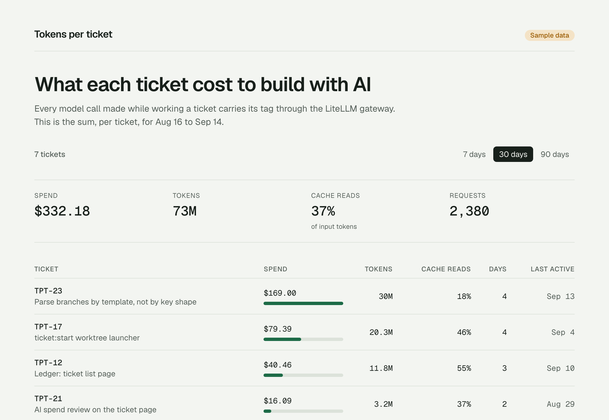
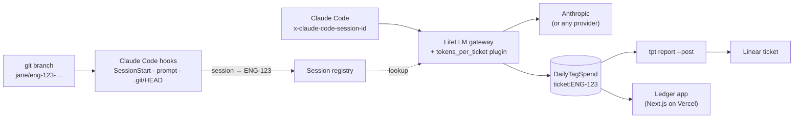
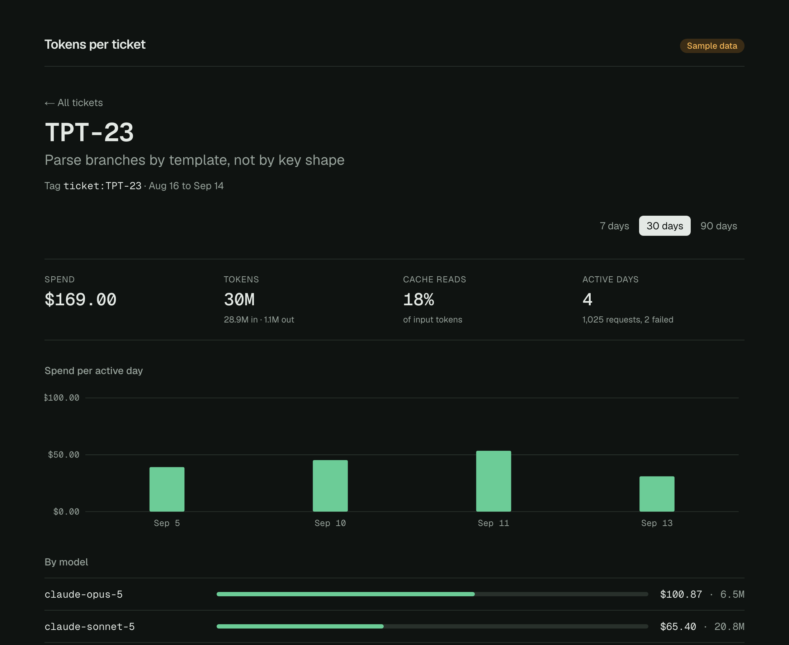

# Tokens per ticket

**What did this ticket cost to build with AI?** This repository makes that a question your gateway can answer, with nobody tagging anything by hand and no command to remember.

An engineer checks out `jane/eng-123-retry-checkout` and works with Claude Code as usual. Hooks committed in the repo tell a small session registry which ticket the session is on, at start, before each prompt, and whenever the branch moves. A plugin in the [LiteLLM](https://docs.litellm.ai) gateway tags every model call with that ticket, and LiteLLM adds up spend per tag. Switch branches mid-session and the spend follows. Commits on the branch get a `Ticket: ENG-123` trailer.

The repo also has a report that lands on the Linear ticket, and a Next.js ledger you can deploy to Vercel. Setting up a product repo is one command, `tpt init`, and one YAML file.



It's a boilerplate and an argument, meant to be copied, adapted, and discussed.

- [Why this exists](#why-this-exists)
- [How it works](#how-it-works)
- [Try it in five minutes](#try-it-in-five-minutes-no-provider-key)
- [Use it for real](#use-it-for-real)
- [The ticket contract](#the-ticket-contract)
- [The ledger app and Vercel](#the-ledger-app-and-vercel)
- [Claude Code integration](#claude-code-integration)
- [Decisions, limits, and gotchas](#decisions-limits-and-gotchas)
- [Working on this repo](#working-on-this-repo)
- [Sources](#sources)

---

## Why this exists

Building with AI agents is cheap to start and easy to overdo. Teams find out what their agents cost when an organization-wide limit is hit, not before, and even then the bill says *who* or *which key*, never *which piece of work*. That makes the useful questions unanswerable:

- What did this feature cost to build, and was it worth it?
- Which tickets burn tokens far out of proportion to their size?
- Is spend going up because we ship more, or because we loop more?

The minimum, to me, is this: **route development traffic through one gateway, and attach the ticket to every call.** Everything else (budgets, dashboards, reviews) builds on that.

### What I think AI-driven engineering should be reviewed on

The repo is built so these can be discussed with real numbers:

1. **Visibility per person and per ticket, not one shared key.** A single org-wide cap tells you about a problem after the damage is done.
2. **Spend next to the outcome.** Tokens on the ticket turn "we spent $X" into "this ticket cost $X for what it delivered".
3. **Caps that stop usage instead of billing it.** Per-developer budgets by default, with an agreed path for heavy runs.
4. **Model choice by task type.** Cheap models for mechanical fan-out, top models for judgment calls. The model split on each ticket shows whether that's happening.
5. **Tokens per ticket is a signal, not a score.** High spend can mean a hard problem. It can also mean the agent went round in loops while no human built a mental model of the feature, which you pay for later in maintenance. Talk about it; don't rank people by it.

---

## How it works



Claude Code can't change request headers during a session: `ANTHROPIC_CUSTOM_HEADERS` is read once at startup ([env vars](https://code.claude.com/docs/en/env-vars)). So the laptop reports *which ticket a session is on*, and the gateway does the tagging, using the `x-claude-code-session-id` header Claude Code sends with every request ([gateway protocol](https://code.claude.com/docs/en/llm-gateway-protocol)).

### What LiteLLM already does, and what this repo adds

The rule for this repo: **don't rebuild what the gateway already does.**

| Need | Where it comes from |
|---|---|
| Add up spend per tag, per day, per model, with cache tokens | LiteLLM's `LiteLLM_DailyTagSpend` table, read through `GET /tag/daily/activity` |
| Accept tags from a request or a pre-call hook | LiteLLM [request tags](https://docs.litellm.ai/docs/proxy/request_tags) and [call hooks](https://docs.litellm.ai/docs/proxy/call_hooks) |
| Budgets per developer key and team, alerts, weekly reports | LiteLLM [virtual keys](https://docs.litellm.ai/docs/proxy/virtual_keys) and [alerting](https://docs.litellm.ai/docs/proxy/alerting) |
| Know a request's Claude Code session | The `x-claude-code-session-id` header, which LiteLLM also records on its own ([request headers](https://docs.litellm.ai/docs/proxy/request_headers)) |
| **Branch name → ticket key**, configurable per team | **This repo:** `tokens-per-ticket.yaml` |
| **Which ticket each session is on, following branch switches** | **This repo:** the `tpt hook` Claude Code hooks and the session registry (`registry/`) |
| **Tag each call with its session's ticket** | **This repo:** `gateway/tokens_per_ticket.py`, a LiteLLM pre-call hook |
| **Commit → ticket** | **This repo:** a `prepare-commit-msg` git hook adding a trailer |
| **Setup in one command** | **This repo:** `tpt init` |
| **The cost on the ticket, and a view people open** | **This repo:** `tpt report --post` and the ledger app |

---

## Try it in five minutes (no provider key)

You need Node 22+, pnpm, and Docker.

```bash
pnpm install
cp gateway/.env.example gateway/.env      # local defaults are fine for a trial
cp .env.example .env.local
pnpm gateway:up                           # LiteLLM v1.100.1 + the plugin, the registry, Postgres
pnpm gateway:smoke                        # tagged calls to a priced mock model
pnpm tpt report SMOKE-1 --days 1           # the report, straight from LiteLLM
pnpm dev                                  # the ledger on :3000 (sample data)
```

To see your gateway's numbers in the ledger instead of sample data, set `LEDGER_DATA=litellm` in `.env.local` and restart `pnpm dev`.

The smoke test runs the automatic path the way the hooks do. It creates a temporary virtual key, reports two sessions to the registry, and calls `mock-ticket-model` with only the session id. Then it checks that the gateway attributed the spend to each session's ticket. The mock model returns a canned answer but still gets tokens counted and priced, so the whole loop runs without an Anthropic key. It calls `/v1/chat/completions`, the only route where LiteLLM prices a mock; Claude Code uses `/v1/messages`, where the same tags land but the mock costs $0. Before rollout, check one real Claude Code session with a provider key.

---

## Use it for real

### 1. Run the gateway, the plugin, and the registry

Locally, `pnpm gateway:up` runs all three. For a team, deploy LiteLLM with Postgres somewhere developers and the ledger can both reach it, following [LiteLLM's deploy guide](https://docs.litellm.ai/docs/proxy/deploy). Put your `ANTHROPIC_API_KEY` in the gateway's environment, and set `LITELLM_MASTER_KEY` and `LITELLM_SALT_KEY`. The salt key can't be rotated once models are stored, so choose it once. `gateway/docker-compose.yml` is the reference layout.

Automatic attribution needs two more things next to LiteLLM:

- **The session registry** (`registry/`, a small Node service with a Dockerfile). Give it **LiteLLM's own Postgres** (`DATABASE_URL`): it keeps its one table in its own `tpt` schema (LiteLLM's upgrades drop unknown tables from `public`) and reads LiteLLM's key table, so it only accepts sessions reported with an active virtual key. Also give it a shared secret, `TPT_REGISTRY_TOKEN`. Developers' hooks must be able to reach it over HTTPS; the gateway plugin calls it on the internal network.
- **The plugin**, `gateway/tokens_per_ticket.py`. Put it next to LiteLLM's `config.yaml`, add `callbacks: tokens_per_ticket.proxy_handler_instance` under `litellm_settings`, and set `TPT_REGISTRY_URL` and `TPT_REGISTRY_TOKEN` in LiteLLM's environment. It adds one registry lookup per model call, cached for 2 seconds with a 300 ms timeout. After three failed lookups in a row it skips new ones for 15 seconds, so an outage costs attribution, not latency. It refuses calls that set their own `ticket:` tag, and pass-through routes (see [step 2](#2-give-each-developer-a-key)).

If you already run LiteLLM for your product, you can point development traffic at the same gateway, but check four things first:

- **It stores spend in Postgres.** `/tag/daily/activity` reads the `LiteLLM_DailyTagSpend` table; a gateway without `DATABASE_URL` has nothing to report.
- **It serves the model names Claude Code asks for**, on the Anthropic Messages format (`/v1/messages`). A product config that only lists your product's models will reject them. The `claude-*` wildcard in `gateway/litellm.config.yaml` is the smallest way to add them ([Claude Code gateway compatibility](https://code.claude.com/docs/en/llm-gateway-protocol)).
- **Pass-through routes.** With the plugin loaded, `/anthropic/*`, `/vertex_ai/*` and other pass-through routes are refused for **every** key, because a ticket tag on them can't be checked. If product traffic uses them, set `TPT_ALLOW_PASS_THROUGH=true` and give developer keys `allowed_routes` (step 2) instead.
- **Its version has `/tag/daily/activity`.** This repo was verified against `v1.100.1`. If yours is older, call the route with an admin key before rolling anything out.

Budgets and alerts you set for the product also see this traffic, and the ledger's key can read the product's spend too.

### 2. Give each developer a key

Developers never use the master key. With more than one team, create a LiteLLM team per engineering team with its own budget, a user per developer, and a virtual key bound to both ([virtual keys](https://docs.litellm.ai/docs/proxy/virtual_keys), [users and teams](https://docs.litellm.ai/docs/proxy/users)). A call is refused when either the key's or the team's budget is used up:

```bash
# Once per team. Keep the returned team_id.
curl -X POST "$LITELLM_BASE_URL/team/new" \
  -H "Authorization: Bearer $LITELLM_MASTER_KEY" -H "Content-Type: application/json" \
  -d '{"team_alias": "payments", "max_budget": 2000, "budget_duration": "30d"}'

# Once per developer.
curl -X POST "$LITELLM_BASE_URL/user/new" \
  -H "Authorization: Bearer $LITELLM_MASTER_KEY" -H "Content-Type: application/json" \
  -d '{"user_id": "mostafa", "user_role": "internal_user", "auto_create_key": false}'
curl -X POST "$LITELLM_BASE_URL/key/generate" \
  -H "Authorization: Bearer $LITELLM_MASTER_KEY" -H "Content-Type: application/json" \
  -d '{"key_alias": "mostafa", "user_id": "mostafa", "team_id": "<team_id>", "max_budget": 200, "budget_duration": "30d", "allowed_routes": ["anthropic_routes"]}'
```

Checked on `v1.100.1`: a key over its team's budget gets `429 budget_exceeded`. The budget is checked before a call and charged after it, so one long request can overshoot it. Add `"models": [...]` to a key to keep some models off-limits.

`"allowed_routes": ["anthropic_routes"]` limits a developer key to what Claude Code calls (`/v1/messages`, token counting). Checked on `v1.100.1`: the same key gets 403 on pass-through routes such as `/anthropic/*` and on `/v1/chat/completions`. Pass-through routes can't be attributed safely, because LiteLLM applies their tag headers after plugins run. The plugin refuses them for every key, unless you set `TPT_ALLOW_PASS_THROUGH=true` for a gateway that also serves product traffic that way.

Developer keys can't read the organization's spend. A key without a user answers 401 on `/tag/daily/activity`. A key bound to an `internal_user` answers **200 with only its own keys' spend** (`_get_tag_daily_activity_api_key_filter` in LiteLLM's `tag_management_endpoints.py`). Never point the ledger or a shared report job at a developer's key: it shows a fraction of the spend and no error.

The ledger needs a key that reads all spend. Don't use the master key for that: create a user with LiteLLM's read-only `proxy_admin_viewer` role ([access control](https://docs.litellm.ai/docs/proxy/access_control)), and remove its model access with `no-default-models`. `/user/new` returns its key:

```bash
curl -X POST "$LITELLM_BASE_URL/user/new" \
  -H "Authorization: Bearer $LITELLM_MASTER_KEY" -H "Content-Type: application/json" \
  -d '{"user_id": "ledger-reader", "user_role": "proxy_admin_viewer", "models": ["no-default-models"]}'
```

Checked on `v1.100.1`: that key reads `/tag/daily/activity` and gets 403 on `/key/generate` and on model calls. Without `no-default-models`, it can call every model with no budget. It can still read everything a viewer can: `/spend/logs` for every request, `/user/list`, `/key/list`, and the callback settings. Treat it like an admin credential. Put it only in Vercel's server-side environment and in whatever posts reports for the org (a CI job, for example). Don't hand a copy to every developer: they can read their ticket's numbers in the ledger.

Review spend calls a model, so give it a separate ordinary key in `LEDGER_REVIEW_API_KEY`, capped and limited to the review model:

```bash
curl -X POST "$LITELLM_BASE_URL/key/generate" \
  -H "Authorization: Bearer $LITELLM_MASTER_KEY" -H "Content-Type: application/json" \
  -d '{"key_alias": "ledger-review", "models": ["claude-haiku-4-5"], "max_budget": 20, "budget_duration": "30d"}'
```

### 3. Connect Claude Code to the gateway

Each developer adds this to `~/.claude/settings.json` ([Claude Code LLM gateway docs](https://code.claude.com/docs/en/llm-gateway)):

```json
{
  "env": {
    "ANTHROPIC_BASE_URL": "https://litellm.your-company.dev",
    "ANTHROPIC_AUTH_TOKEN": "sk-...their virtual key..."
  }
}
```

While a gateway credential is active, Claude Code bills per token to whoever owns the provider key behind the gateway, not to the developer's claude.ai subscription. If your team keeps subscriptions, follow LiteLLM's [Max subscription setup](https://docs.litellm.ai/docs/tutorials/claude_code_max_subscription), which passes the virtual key as `x-litellm-api-key` in `ANTHROPIC_CUSTOM_HEADERS`. The hook reads it from there, so tokens are still counted per ticket, but they aren't billed per token.

To use a registry other than the one in the repo's `tokens-per-ticket.yaml`, also set `"TPT_REGISTRY_URL": "https://…"` here.

That's the only per-person step, and it isn't even that with [managed settings](https://code.claude.com/docs/en/managed-settings): an admin can deliver `ANTHROPIC_BASE_URL` and `TPT_REGISTRY_URL` to every machine, leaving each engineer only their key. The hook finds the key in `ANTHROPIC_AUTH_TOKEN`, `ANTHROPIC_API_KEY`, or `x-litellm-api-key` in `ANTHROPIC_CUSTOM_HEADERS`. With an `apiKeyHelper` it can't, and those sessions aren't attributed.

### 4. Set up each repository, once

In the product repository, run the CLI from a clone of this repo:

```bash
node ../tokens-per-ticket/.tokens-per-ticket/tpt.mjs init --teams ENG,WEB --registry-url https://litellm.your-company.dev:4100
git add tokens-per-ticket.yaml .tokens-per-ticket .claude .gitignore && git commit -m "chore: adopt tokens-per-ticket"
```

`init` is safe to run again, and it only adds:

- **`tokens-per-ticket.yaml`**, with Linear-style branch rules. Edit it if your branches look different ([the contract](#the-ticket-contract)).
- **`.tokens-per-ticket/tpt.mjs`**, the whole CLI in one file with no dependencies. Every engineer needs Node 18 or newer on their PATH (the hook skips silently without it); nothing else to install, no `tsconfig` or `package.json` changes, and it works with npm, pnpm, or no Node project at all. Fresh clones and worktrees have it as soon as they check out.
- **Hooks and permissions merged into `.claude/settings.json`**. Existing entries are kept.
- **The `/ticket-cost` and `/ticket-start` skills.**
- **`.env.local` in `.gitignore`**, if it isn't ignored yet. `tpt report` reads its spend key from there.
- **A `prepare-commit-msg` git hook** for the commit trailer, in `.git/hooks`. It isn't versioned, so a fresh clone gets it at its first Claude Code session; commits made before that have no trailer. With `core.hooksPath` (husky), `init` prints the line to add instead. An existing hook, such as husky's, is never overwritten; `init` tells you the one line to add to it.

Commit the files: every clone and worktree needs them.

**Rolling out.** Branches opened before this commit don't have these files, so their sessions aren't attributed, and a session that switches to one stops counting (the hook says so). Merge your default branch into in-flight ticket branches to include them.

### 5. Work as usual

Check out a ticket branch, with Linear's "Copy git branch name" or any tool, and start `claude` at the repository root (Claude Code reads `.claude/settings.json` from the directory you start it in, so a session started in a monorepo subfolder runs no hooks; checked with Claude Code 2.1.271). That's all:

- **Session start.** The hook reports the session's ticket, names the session `ENG-123`, and tells Claude which ticket its work counts toward.
- **Branch switch.** Switching with `git switch`, from Claude's Bash, or from your IDE fires a `FileChanged` event on `.git/HEAD` ([hooks](https://code.claude.com/docs/en/hooks)). The session's next calls count toward the new ticket, and you see a one-line note.
- **Before each prompt.** A cheap re-check catches anything missed. It only calls the registry when something changed, or every 10 minutes.
- **Branches outside the contract** (`main`, spikes) aren't attributed. That's the honest answer.
- **Commits** on a ticket branch get `Ticket: ENG-123`.

When something is off, the hook says so once, in one line: Claude Code isn't pointed at the gateway, there's no key, or the registry can't be reached.

### 6. See what it cost

```bash
node .tokens-per-ticket/tpt.mjs report                  # the current branch's ticket, last 30 days
node .tokens-per-ticket/tpt.mjs report ENG-123 --post   # also create or update the comment on the ticket
```

In this repo, `pnpm tpt report` does the same. The report reads `LITELLM_BASE_URL` and `LITELLM_API_KEY` from `.env.local` (see `.env.example`). That key reads the whole organization's spend (see [step 2](#2-give-each-developer-a-key)), so don't copy it to every laptop. Set `automation.ledger_url` in `tokens-per-ticket.yaml` instead: engineers without the key get a link to the ticket in the ledger.

Post reports from one place that holds the key, such as CI. For example, when a PR is merged:

```yaml
# .github/workflows/ticket-report.yml
on:
  pull_request:
    types: [closed]
jobs:
  report:
    if: github.event.pull_request.merged
    runs-on: ubuntu-latest
    steps:
      - uses: actions/checkout@v4
      - run: node .tokens-per-ticket/tpt.mjs report --branch "$BRANCH" --days 90 --post
        env:
          BRANCH: ${{ github.event.pull_request.head.ref }}
          LITELLM_BASE_URL: ${{ secrets.LITELLM_BASE_URL }}
          LITELLM_API_KEY: ${{ secrets.LITELLM_SPEND_READER_KEY }}
          LINEAR_API_KEY: ${{ secrets.LINEAR_API_KEY }}
```

`--branch` reads the ticket from the PR's branch name using the contract, the same way the hooks do.

`--post` writes to the tracker named in `tokens-per-ticket.yaml`: `tracker: linear` (needs `LINEAR_API_KEY`) or `tracker: jira` (Jira Cloud, needs `JIRA_BASE_URL`, `JIRA_EMAIL`, and an [API token](https://id.atlassian.com/manage-profile/security/api-tokens) in `JIRA_API_TOKEN`). It keeps exactly one report comment per ticket, written by that account and updated on every run, and never edits anyone else's comment. For other trackers, run the report without `--post` and paste it in.



### 7. Optional: a worktree per ticket

To work two tickets side by side, `tpt start` gives each one its own worktree and session:

```bash
node .tokens-per-ticket/tpt.mjs start ENG-124 "retry on 429"   # or /ticket-start
```

It names the branch from the contract, creates the worktree next to the repo without touching your checkout, and launches `claude` there named `ENG-124`. The worktree's branch attributes the session like any other. Use `--print` to get the command instead of launching, and `--base origin/main` to choose where the branch starts.

---

## The ticket contract

`tokens-per-ticket.yaml` is the one file a team edits:

```yaml
tracker: linear                       # where report --post writes: linear or jira
key:
  pattern: "[A-Z][A-Z0-9]*-[0-9]+"   # how your tracker prints keys
  teams: []                           # optional allowlist, e.g. [ENG, AIS]
branch:
  template: "{user}/{key}-{slug}"     # Linear's default "Copy git branch name"; {user}, {key}, {KEY}, {slug}
worktree:
  path: "../{repo}.worktrees/{branch}"
automation:
  sessions: true                      # hooks report each session's ticket to the registry
  registry_url: "http://localhost:4100"  # per machine: TPT_REGISTRY_URL overrides it
  commit_trailer: "Ticket"            # or false
```

Branches are parsed **by the template**, not by searching for something that looks like a key. A loose search reads `dependabot/npm_and_yarn/next-16` as ticket `NEXT-16`. With the template, branches outside the contract (`main`, bots) are simply unattributed. The template alone still reads `fix/utf-8-parsing` as `UTF-8`, so set `teams` (or `init --teams`) to your tracker's team keys. A detached HEAD (mid-rebase, or a CI checkout) names no branch, so that spend is unattributed too.

`{key}` writes the key lowercased, as Linear does. `{KEY}` keeps it as the tracker prints it. Using Jira with `feature/PROJ-42_login`? Set `template: "feature/{KEY}_{slug}"`: Jira only [links branches whose key is uppercase](https://support.atlassian.com/jira-software-cloud/docs/reference-issues-in-your-development-work/), and on a case-insensitive file system (macOS) a lowercased `feature/proj-42_login` collides with an existing `feature/PROJ-42_login`. Parsing is case-insensitive either way, so hand-typed branches still count. `report --post` writes to Linear or Jira; see [step 6](#6-see-what-it-cost).

A `teams` allowlist also filters the ledger, `tpt report`, and the hook: tags for other teams are ignored. That includes the sample data (`TPT-*`) and `tpt report SMOKE-1`, so try the five-minute loop before you set it.

---

## The ledger app and Vercel

The ledger is a Next.js 16 app with two pages: every ticket in a date range, and one ticket's spend per day, split by model. The ticket page previews exactly what `--post` writes to the ticket.

It has one AI feature, **Review spend**. A model reads a ticket's numbers and points out what's worth a conversation. That call goes through the same gateway, tagged `app:ledger`, so the app's own runtime tokens never count toward any ticket.

### Environment

| Variable | Purpose |
|---|---|
| `LEDGER_DATA` | `sample` (default) or `litellm` |
| `LITELLM_BASE_URL` | Gateway URL |
| `LITELLM_API_KEY` | A key that reads all spend: the master key locally, a [`proxy_admin_viewer` key with `no-default-models`](#2-give-each-developer-a-key) in production. Not a developer's key, which silently reads only its own spend. Server-side only; never prefix it with `NEXT_PUBLIC_`. |
| `LEDGER_REVIEW_MODEL` | Model for Review spend, e.g. `claude-haiku-4-5`. Empty turns the feature off. In production it also needs `LEDGER_BASIC_AUTH`, because each click spends tokens. |
| `LEDGER_REVIEW_API_KEY` | The [budgeted key](#2-give-each-developer-a-key) Review spend calls the model with. Falls back to `LITELLM_API_KEY`, which is only right locally. |
| `LEDGER_BASIC_AUTH` | `user:password`. Required in production when `LEDGER_DATA=litellm`. |
| `LINEAR_API_KEY`, or `JIRA_BASE_URL` + `JIRA_EMAIL` + `JIRA_API_TOKEN` | Only for `tpt report --post` |

### Deploying

Import the repository into Vercel. Nothing else is needed for a public demo: sample data is the default, and it's labelled as sample data on every page. Leave `LEDGER_REVIEW_MODEL` unset on a public demo; the app keeps the review off in production without `LEDGER_BASIC_AUTH`.

To deploy against a real gateway:

1. Set `LEDGER_DATA=litellm`, `LITELLM_BASE_URL`, and `LITELLM_API_KEY`. The ledger's functions call the gateway from Vercel, so `LITELLM_BASE_URL` must be reachable from there, not only from your office network or VPN.
2. Set `LEDGER_BASIC_AUTH`. The app refuses to show live data in production without it, because the ledger shows the whole organization's spend.
3. For more than a team demo, put it behind [Vercel Deployment Protection](https://vercel.com/docs/deployment-protection) or your SSO as well.

`tokens-per-ticket.yaml` is read at request time and included in every function through `outputFileTracingIncludes` in `next.config.ts`.

---

## Claude Code integration

Everything lives in the repo and is committed, so the whole team gets it:

- **Hooks.** In `.claude/settings.json`, `SessionStart`, `UserPromptSubmit`, `FileChanged`, and `CwdChanged` all run `tpt hook` (source: `src/cli/hook.ts`). The hook reports the session, keeps `.git/HEAD` watched, names the session after its ticket unless you named it yourself, and warns once when something is missing. It never blocks. Each run takes 60–150 ms; it calls the registry at session start, on a branch switch, and otherwise only when something changed or every 10 minutes.
- **`/ticket-cost`** runs the report and adds up to three observations the numbers support. It posts to the tracker only when you ask.
- **`/ticket-start ENG-123 title`** prepares a separate worktree and gives you the command to paste.

---

## Decisions, limits, and gotchas

**How attribution works, and why this way**

- **Why a registry.** Claude Code can't change API request headers during a session; its only header helpers are for OpenTelemetry and plugin downloads ([settings](https://code.claude.com/docs/en/settings)). A session-to-ticket map the gateway reads is the smallest thing that follows branch switches.
- **Subagents count toward their session.** They share its session id. Claude Code passes `agent_id` to hooks only on tool events, so a subagent working in another worktree is still billed to the session's ticket.
- **Scope: Claude Code behind LiteLLM, on purpose.** That's where per-request session ids and a pluggable gateway exist today. Other tools (Cursor, Codex) and other gateways (Claude apps gateway, Portkey) aren't attributed. The registry's session-to-ticket map doesn't depend on the gateway, so an adapter for another gateway is the natural extension.

**Who can attribute what**

- **Only the gateway sets tickets.** With the plugin on, a request that sets its own `ticket:` tag (in `x-litellm-tags` or the body) gets a clear 400, and so do pass-through routes such as `/anthropic/*`, where tags can't be checked (`TPT_ALLOW_PASS_THROUGH=true` if a shared gateway needs them). Developer keys with `allowed_routes: ["anthropic_routes"]` can't reach pass-through at all. LiteLLM's spend logging reads a copy of the request metadata taken before plugins run, so the plugin writes the ticket there too (checked on `v1.100.1`).
- **The registry authenticates with the developer's own key.** The hook sends the LiteLLM virtual key it already uses as a bearer token, to the registry URL from `TPT_REGISTRY_URL` or `tokens-per-ticket.yaml`. Serve the registry over HTTPS. The registry hashes it, looks it up by primary key in LiteLLM's key table (active, not blocked, not expired), and stores only `sha256(key)`, the form LiteLLM gives plugins. A session belongs to the key that first reported it, and the plugin only tags calls from that key, so a report can only ever attribute the reporter's own calls. The master key isn't a virtual key, so its sessions aren't attributed and the hook says so. The flip side: someone who learns a colleague's session id before their hook reports it can claim it, and that session goes unattributed (never charged elsewhere). Session ids are random UUIDs that stay on the laptop and in gateway logs. In production give the registry a role with only `SELECT` on `"LiteLLM_VerificationToken"` and the `tpt` schema (create it once as an admin, or let the registry create it on first start).
- **Repo config is trusted like repo code.** A repository decides where its hooks send the key (`tokens-per-ticket.yaml`) and what they run (`.claude/settings.json` can set any command or env var). That is [Claude Code's trust model](https://code.claude.com/docs/en/permissions) for project hooks, so there is no second check here.
- **Which code the hooks run.** The Claude Code hooks and the git hook run the committed `.tokens-per-ticket/tpt.mjs`, the way husky runs committed scripts. On a branch from before adoption, which has no such file, they run a copy of the CLI from the last project a session started in, kept in `~/.local/state/tokens-per-ticket/`, only to stop charging the previous ticket. A branch can change the committed file, and it can change `.claude/settings.json` itself, which is [Claude Code's trust model](https://code.claude.com/docs/en/permissions) for any project hook. Review changes to `.claude/` and `.tokens-per-ticket/` like any other code, for example with a CODEOWNERS entry.

**Accuracy**

- **Unattributed Claude Code spend is visible.** The ledger's *Attributed* figure compares ticket spend with Claude Code spend, from the `User-Agent: claude-cli` tag LiteLLM adds to every Claude Code call. That tag comes from the client, so spend from other clients, or a changed User-Agent, is in neither figure: for a full picture, compare with per-key spend in LiteLLM's own UI.
  - **What the gap covers:** work on `main`, sessions started in a subfolder instead of the repository root, sessions without a registry connection, or a registry that couldn't be reached.
  - **Registry trouble never fails a call.** After three failed lookups in a row, the plugin pauses new lookups for 15 seconds and keeps tagging sessions it already knows.
- **Tags can lag a switch by a moment.** Sessions are cached for 2 seconds, and a `FileChanged` event can arrive just after the call that followed the switch. LiteLLM also writes spend in batches, so the last minute may not show yet.
- **No double counting.** Every request also carries LiteLLM's `User-Agent` tags, so the ledger reads per-tag breakdowns and never adds a day's totals across tags.
- **Input tokens include cache reads and writes**, as LiteLLM folds them into `prompt_tokens`. The cache share is cache reads ÷ input tokens.
- **Costs are LiteLLM's price-map estimates**, not your invoice.
- **Development tokens only.** The ledger's own review calls are tagged `app:ledger`.
- **Tag budgets don't see automatic tags.** LiteLLM checks them during auth, before the plugin runs. Key and team budgets work as usual.
- **Pinned to LiteLLM `v1.100.1`**, the version verified here. The plugin relies on how that version handles request metadata, so re-run `pnpm gateway:smoke` after upgrading.

---

## Working on this repo

```bash
pnpm dev             # ledger on :3000
pnpm test:unit       # node:test via tsx, including responses recorded from a real gateway
pnpm test:registry   # the session registry (set TPT_TEST_DATABASE_URL to include the Postgres test)
pnpm test:gateway    # the LiteLLM plugin (Python, no LiteLLM needed)
pnpm test:e2e        # Playwright on :3100, desktop + phone, sample data
pnpm build:cli       # rebuild .tokens-per-ticket/tpt.mjs after changing src/cli or src/lib
pnpm typecheck
pnpm lint
```

```
tokens-per-ticket.yaml       the one file a team edits
.tokens-per-ticket/tpt.mjs   the built CLI that init copies into repos (generated, committed)
src/cli/                     hook, git trailer, init, report, start
src/lib/                     contract, LiteLLM client, ledger math, report, Linear, registry client
src/app/                     the ledger (Next.js 16 App Router)
gateway/                     LiteLLM + plugin + registry + Postgres (docker compose)
registry/                    the session registry service
scripts/                     build-cli, gateway:smoke
.claude/                     this repo's own hooks and skills, written by tpt init
tests/unit, tests/e2e        unit and browser tests; tests/fixtures holds recorded gateway responses
```

Work here the way the repo argues for: ticket branches, small commits with [Conventional Commits](https://www.conventionalcommits.org) messages (`feat(cli): …`, `fix(ledger): …`), and a Playwright spec with any UI change. The details are in [CLAUDE.md](CLAUDE.md).

---

## Sources

Every integration point above was checked against these, and where noted, against LiteLLM's source and a running `v1.100.1` gateway:

- Claude Code: [LLM gateways](https://code.claude.com/docs/en/llm-gateway), [gateway protocol and headers](https://code.claude.com/docs/en/llm-gateway-protocol), [environment variables](https://code.claude.com/docs/en/env-vars), [settings precedence](https://code.claude.com/docs/en/settings), [CLI flags](https://code.claude.com/docs/en/cli-reference), [hooks](https://code.claude.com/docs/en/hooks), [skills](https://code.claude.com/docs/en/skills)
- LiteLLM: [Claude Code cost tracking](https://docs.litellm.ai/docs/tutorials/claude_code_customer_tracking), [request tags](https://docs.litellm.ai/docs/proxy/request_tags), [request headers](https://docs.litellm.ai/docs/proxy/request_headers), [deploy](https://docs.litellm.ai/docs/proxy/deploy), [call hooks](https://docs.litellm.ai/docs/proxy/call_hooks), [custom pricing](https://docs.litellm.ai/docs/proxy/custom_pricing), [tag budgets](https://docs.litellm.ai/docs/proxy/tag_budgets), [alerting](https://docs.litellm.ai/docs/proxy/alerting), [spend log retention](https://docs.litellm.ai/docs/proxy/spend_logs_deletion)
- Claude Code hooks were also checked in a live session: `SessionStart` returning `.git/HEAD` in `watchPaths`, then `FileChanged` on every `git switch`
- git: [interpret-trailers](https://git-scm.com/docs/git-interpret-trailers), [hooks](https://git-scm.com/docs/githooks)
- Linear: [GraphQL API](https://linear.app/developers/graphql), [branch naming](https://linear.app/changelog/2020-04-13-branch-naming)
- Next.js 16 docs shipped in `node_modules/next/dist/docs` (Proxy, `connection()`, output file tracing)

## License

MIT
